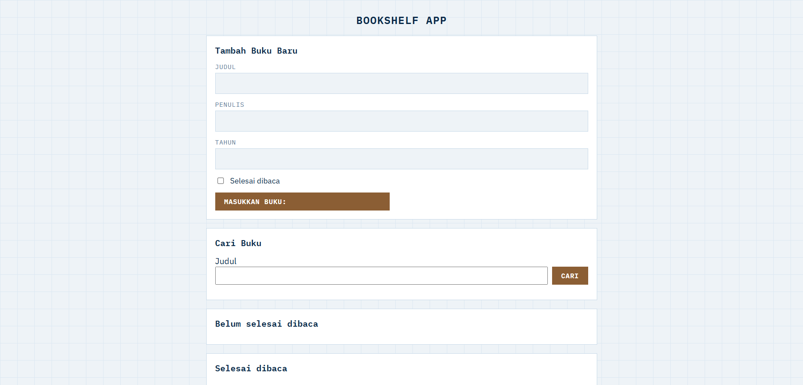

# Bookshelf App

Final submission for Dicoding's "Belajar Membuat Front-End Web untuk Pemula" — add,
search, edit, delete, and mark books as read, all persisted to `localStorage`.

**Live demo:** [hunafazaky.github.io/bookshelf-app](https://hunafazaky.github.io/bookshelf-app)

## Features

- Add books with title, author, year, and read status
- Search by title, results update live and stay in sync after any edit
- Edit or delete a book, toggle its read status
- Two shelves: belum selesai dibaca / selesai dibaca
- Everything persists in `localStorage` — no backend

## Submission requirements

All `data-testid` and `data-bookid` attributes required by the assignment spec are
present and unchanged — see the book card `<template>` in `index.html`.

## Run Locally

Just open `index.html` in your browser — no install, no build step.

## License

MIT
